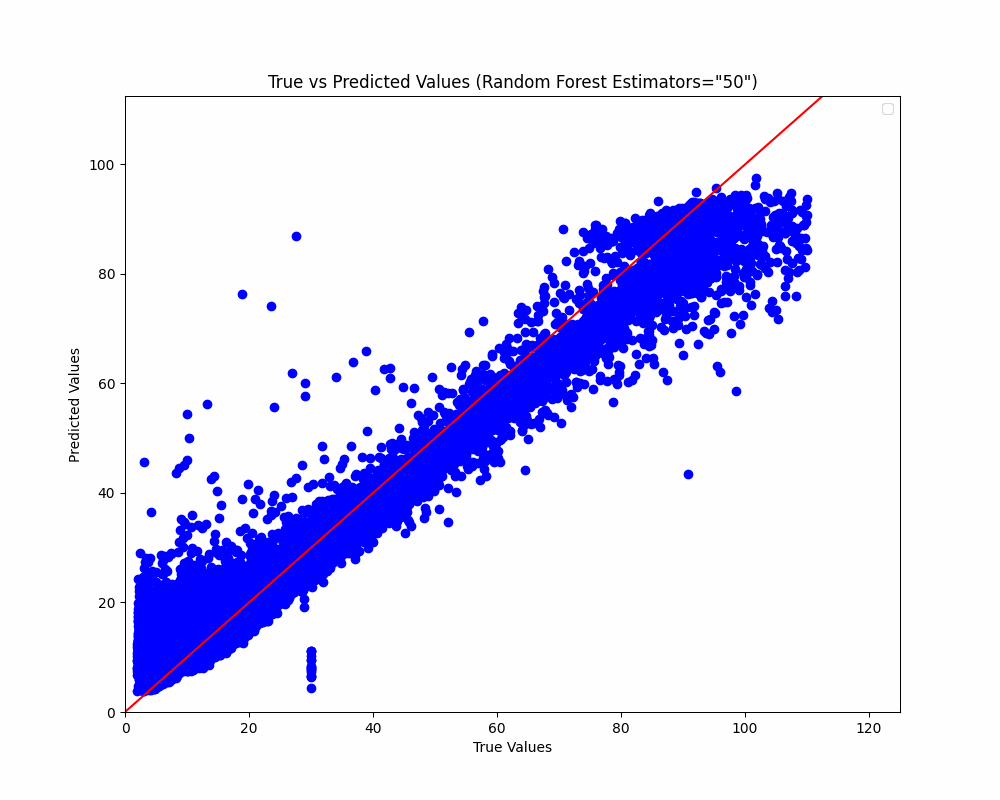
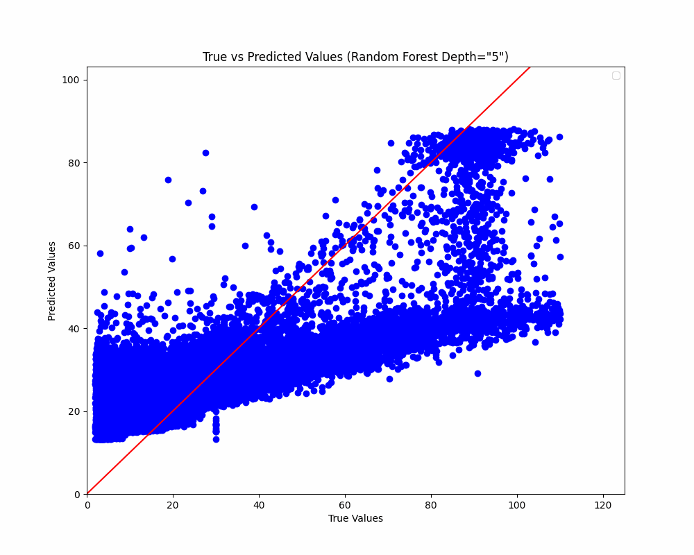

# CERN Electron Mass Prediction
A couple months ago I found a really cool dataset from the CERN partical collider, and I decided it'd be cool to do some ML stuff with it because it looked really neat.
I decided to predict the mass of the electrons based off everything else about them (energy, momentum, etc)
## Hyperparameter Tuning Graphs

I wanted to see how different hyperparmeters for the RandomForestRegressor affected the actual results, and I found some pretty cool trends.
Namely, the max depth of the tree mattered way more than the max amount of estimators, as can be seen from the animated graphs I made below

you can clearly see that the max depth provides massive improvements when it's increased, as opposed to the n_estimators graph, which barely changes at all.
